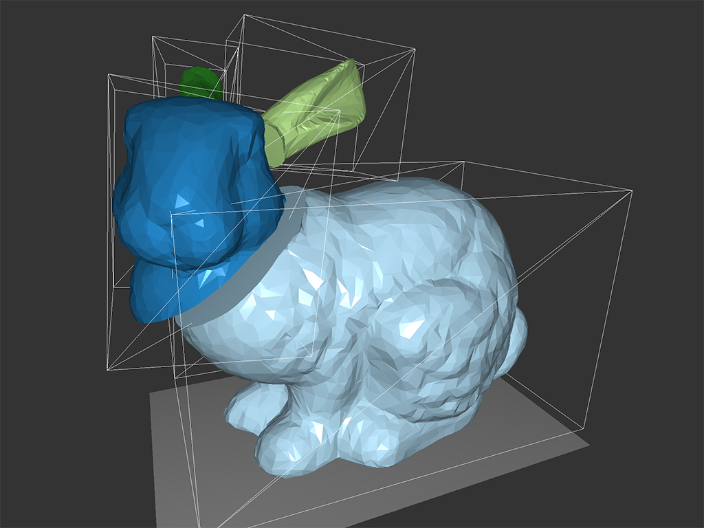

# Real Time Voronoi Fracturing of Polygon Meshes

An implementation of real time voronoi fracturing in C++ and OpenGL. The project idea is based on the paper *Real Time Dynamic Fracture
with Volumetric Approximate Convex Decompositions* by [Müller et al](http://matthias-mueller-fischer.ch/publications/fractureSG2013.pdf).

Demo: https://vimeo.com/150522450

## User controlls

``W`` Move centroid forwards
``S`` Move centroid backwards
``A`` Move centroid left
``D`` Move centroid right
``E`` Move centroid up
``Q`` Move centroid down
``Up arrow`` Choose next centroid
``Down arrow`` Choose previous centroid
``C`` Add new voronoi centroid
``Enter`` Apply user defined voronoi pattern
``P`` Apply pre-defined voronoi pattern
``O`` Apply physics

## Compiling and running

The supplied Makefile supports Mac OS X and Linux

Compile with ``make`` and run with ``make run``

## Dependencies

* Bullet Physics

* GLM